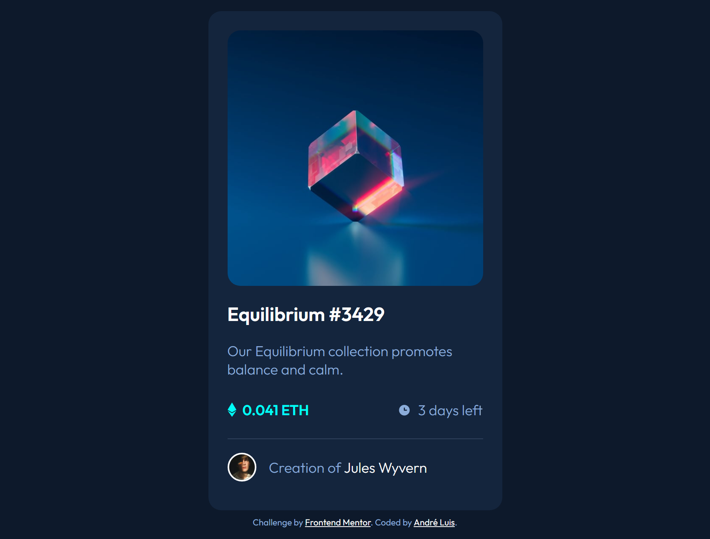

<h1 align="center"> Frontend Mentor - NFT preview card component solution </h1>

This is a solution to the [NFT preview card component challenge on Frontend Mentor] (https://www.frontendmentor.io/challenges/nft-preview-card-component-SbdUL_w0U). Frontend Mentor challenges help you improve your coding skills by building realistic projects.

 

  <a href="#-tecnologias">Tecnologias</a>&nbsp;&nbsp;&nbsp;|&nbsp;&nbsp;&nbsp;
  <a href="#-projeto">Projeto</a>&nbsp;&nbsp;&nbsp;|&nbsp;&nbsp;&nbsp;
  <a href="#-screenshots">Screenshots</a>&nbsp;&nbsp;&nbsp;|&nbsp;&nbsp;&nbsp;
  <a href="#-links">Links</a>&nbsp;&nbsp;&nbsp;

 

## 🚀 Tecnologias

Esse projeto foi desenvolvido com as seguintes tecnologias:

- HTML e CSS

## 💻 Projeto

O desafio era construir esse card de NFT preview e fazê-lo o mais próximo possível do design original, responsivo e atendendo aos estados de foco para elementos interativos.
   
O desafio mesmo sendo de um projeto simples permite treinar aspectos importantes do HTML e CSS.

## 📸 Screenshots

  

## 🌎 Links

- Solution: [https://www.frontendmentor.io/solutions/nft-preview-card-component-html-css-OHsV0SwTrC](https://www.frontendmentor.io/solutions/nft-preview-card-component-html-css-OHsV0SwTrC)
- Live Site: [https://nft-preview-card-aandreluis.netlify.app/](https://nft-preview-card-aandreluis.netlify.app/)

---
